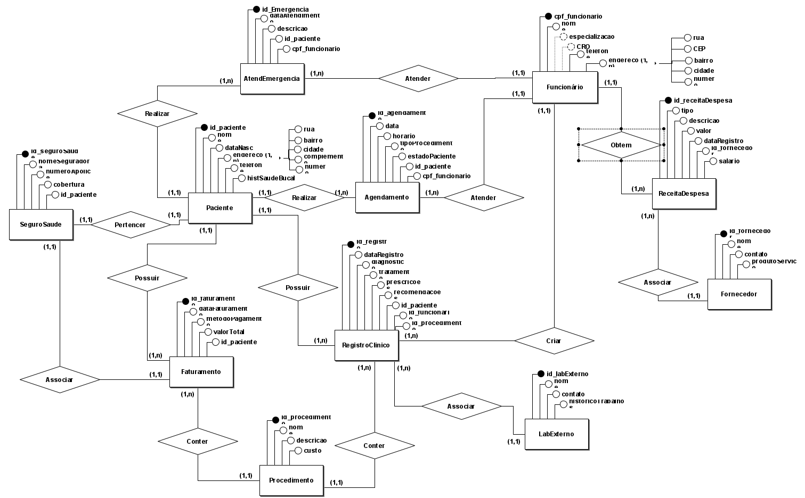
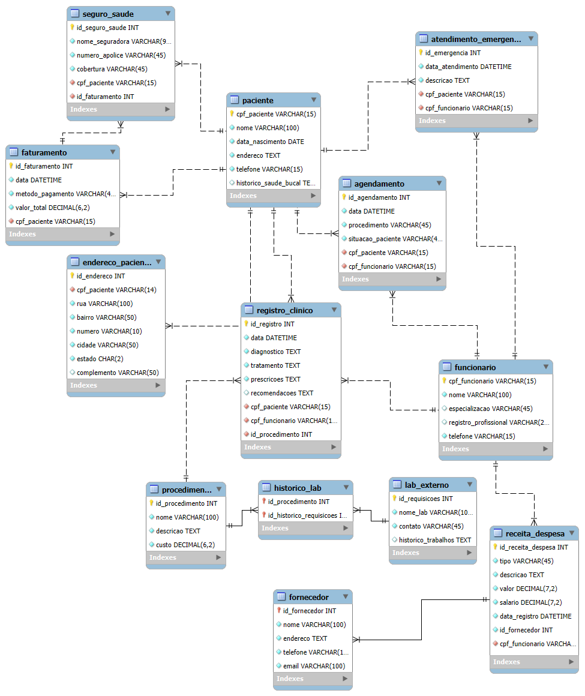

# Clínica Odontológica - Projeto de Banco de Dados

Este é um projeto acadêmico desenvolvido para gerenciar o banco de dados de uma clínica odontológica fictícia, com o objetivo de aplicar conceitos de modelagem, normalização e operações SQL. Este repositório contém os scripts SQL de criação, inserção, consulta e manutenção das tabelas, além de alterações estruturais feitas para melhorar a eficiência e a organização dos dados.

## Índice
- Sobre o Projeto
- Modelagem do Banco de Dados
- Estrutura do Projeto
- Tecnologias Utilizadas
- Como Utilizar
- Scripts SQL
  - Tabelas
  - Consultas e Manipulação de Dados
  - Alterações
- Licença

## Sobre o Projeto
Este projeto foi desenvolvido como parte de um curso de banco de dados, com foco em práticas de SQL para sistemas de gestão de clínicas odontológicas. Inclui funcionalidades de gerenciamento de pacientes, dentistas, procedimentos, agendamentos, histórico clínico, e faturamento.

O projeto visa demonstrar conhecimentos em:

- Criação e manipulação de tabelas;
- Relações e integridade referencial entre dados;
- Consultas SQL avançadas para extração de informações;
- Uso de restrições e índices;
- Modelagem de dados para sistemas de saúde.

#### Diagrama Entidade-Relacionamento


#### Modelo Lógico


## Estrutura do Projeto
A estrutura do projeto é organizada da seguinte forma:

```
📁 /clinica-odontologica
├── 📄 README.md                    # Documento de apresentação do projeto
├── 📄 create_tables.sql            # Scripts para criação das tabelas
├── 📄 insert_data.sql              # Scripts para inserção de dados
├── 📄 queries.sql                  # Exemplos de consultas SQL
├── 📄 alter_tables.sql             # Scripts de alterações nas tabelas
├── 📄 drop.sql                     # Scripts para deletar tabelas do banco de dados
├── 📄 update_delete.sql            # Scripts para operações de atualização e exclusão de dados
├── 📄 views.sql                    # Scripts para criação de views no banco de dados
└── 📁 diagramas/                   # Diretório para armazenar diagramas (PNGs)
```

## Tecnologias Utilizadas

- *SQL* - para criação e manipulação de dados no banco.
- *MySQL Workbench* - para modelagem e execução das queries e scripts.
- *brModelo* - para criação do diagrama entidade-relacionamento (DER).

## Como Utilizar
*1. Clone o repositório para sua máquina:*

```
git clone https://github.com/GabrielSan06/clinica-odontologica.git
cd clinica-odontologica
```


*2. Importe os scripts para o seu SGBD (MySQL ou PostgreSQL, dependendo da compatibilidade):*

- Execute o script create_tables.sql para criar as tabelas.
- Em seguida, execute alter_tables.sql para fazer as alterações necessárias nas tabelas.
- Por fim, execute insert_data.sql para preencher as tabelas com dados de exemplo.

*3. Para consultar e manipular os dados, utilize os comandos SQL no arquivo queries.sql.*

## Scripts SQL

#### Tabelas
- **Paciente**: Informações pessoais e histórico de saúde bucal dos pacientes.
- **Funcionario**: Informações dos funcionários, incluindo dentistas e equipe administrativa.
- **Procedimento**: Detalhes dos procedimentos realizados na clínica.
- **Agendamento**: Agendamentos e consultas marcadas.
- **Atendimento_Emergencia**: Registros de atendimentos de emergência.
- **Faturamento**: Informações financeiras relacionadas aos atendimentos.
- **Seguro_Saude**: Dados de seguros de saúde associados aos pacientes.
- **Historico_Lab**: Histórico de análises realizadas por laboratórios externos.
- **Lab_Externo**: Informações sobre laboratórios parceiros para exames externos.
- **Fornecedor**: Dados dos fornecedores de materiais e equipamentos da clínica.
- **Receita_Despesa**: Registros de receitas e despesas para controle financeiro da clínica.


#### Consultas e Manipulação de Dados
O arquivo queries.sql inclui exemplos de consultas, como:

- Listagem de agendamentos por paciente e dentista.
- Total de faturamento por mês e ano.
- Pacientes com procedimentos específicos.

## Alterações

O arquivo alter_tables.sql inclui scripts de ALTER TABLE com modificações na estrutura inicial do banco de dados.

## Licença
Este projeto é licenciado sob a *MIT License*.
